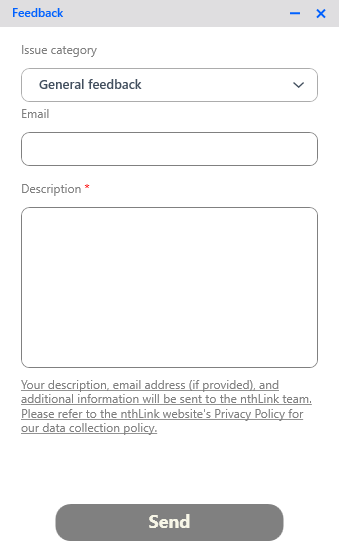

# nthlink Windows App

## Introductions

[nthlink](https://www.nthlink.com/) is an anti-censorship mobile application capable of
circumventing Internet censorship and self-recovering from blocking events.

The purpose of nthlink is enabling everyday users in censored regions to gain safer and unfettered
access to the Internet.

## UX / UI

Basically, our app has only one main function, the other functions are related to customer service.

### Home Page

There is one button named connect in home page, which is the function of start the connection.
Click the disconnect button when connected, nthlink will disconnect to VPN server.

### Home Page Menu

There is menu button at top left in home page will pop menu when click. 
Menu has three button items feedback, about and help.
Feedback and about button will navigate to their page when click, and help button open [help website](https://s3.us-west-1.amazonaws.com/dwo-jar-kmf-883/help.html) on default browser at private mode.

### Feedback Page

Users can fill up the form and feedback to us.

### About Page

This page has nthLink information.

## Architecture / Source Code

### High Level overview

There are two steps within connection.

1. After click connecting button, nthlink will connect to VPN server.

### Some of the uncommon codebase

For the best user experience, we will collect information for analysis. nthlink will collect web
page events, such as launch landing page and user click.

